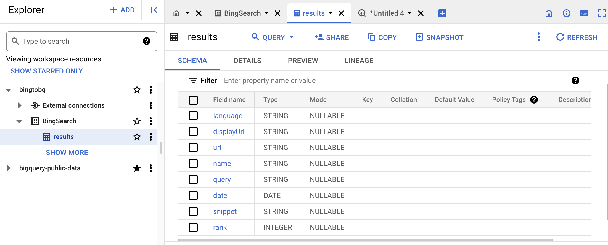
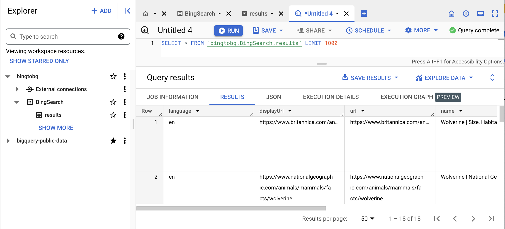

# BingtoBQ
## Bing Web Search API

### Getting subscription key for the Bing API
See the [pricing](https://www.microsoft.com/en-us/bing/apis/pricing) and click [TRY NOW](https://portal.azure.com/#create/microsoft.bingsearch). If you have logged in to the Azure account you will bee redirected to the create page whene you click the try now button. I am using the free instance with 3 transactions per second and 1000 transactions per month. I followed the. steps from [this site](https://learn.microsoft.com/en-us/bing/search-apis/bing-web-search/create-bing-search-service-resource)

Once the deployment is complete you can go to the resource and get the keys and the endpoint url.

The config.py is not included which has the sunscription keey. endpoint url and input and output file names
The data_extract.py will read the input comma separted keywords text file and call the api for each keyword and write the webpagees ressult in a csv file.

## BigQuery PRoject Table Creation

I used BigQuery Sandbox to create a project,dataset and a table on Google Cloud.

Then Added the table schema for the table.

Updated my data_extract python script to load the pandas dataframe to Bigquerytable after installing goole cloud sdk, google-cloud-bigquery package and pyarrow package.

